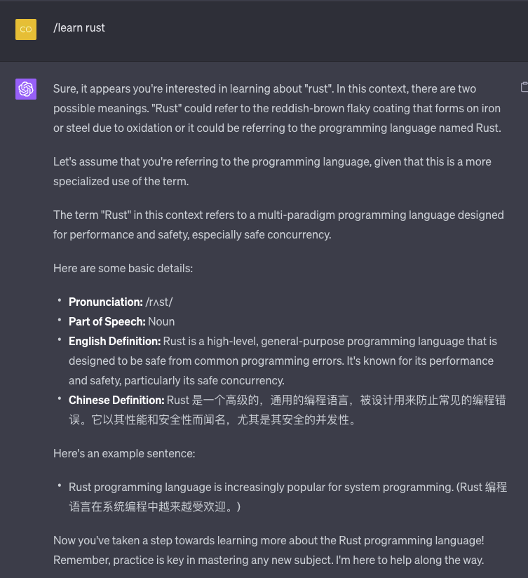
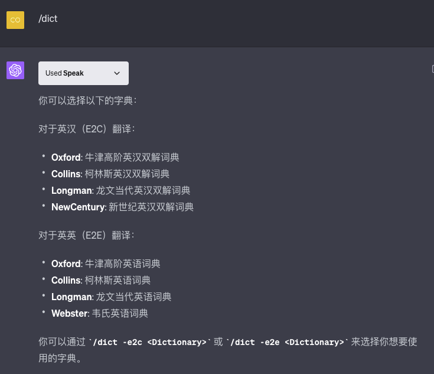
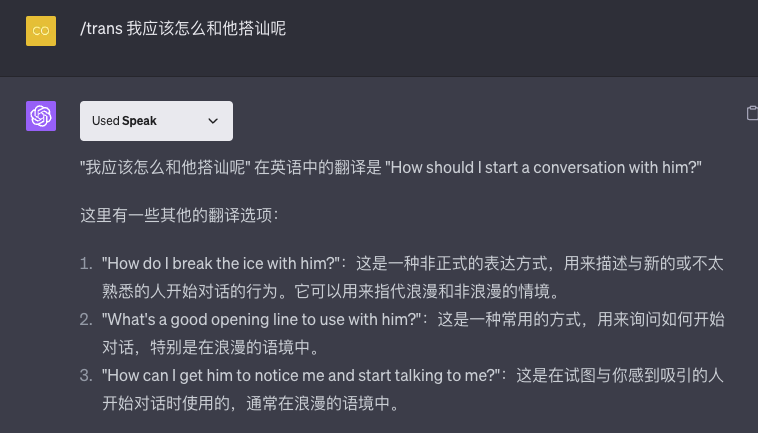
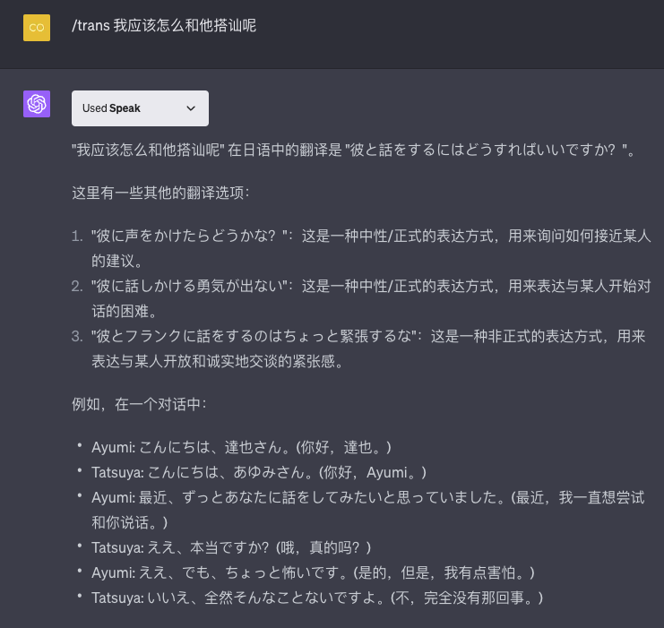
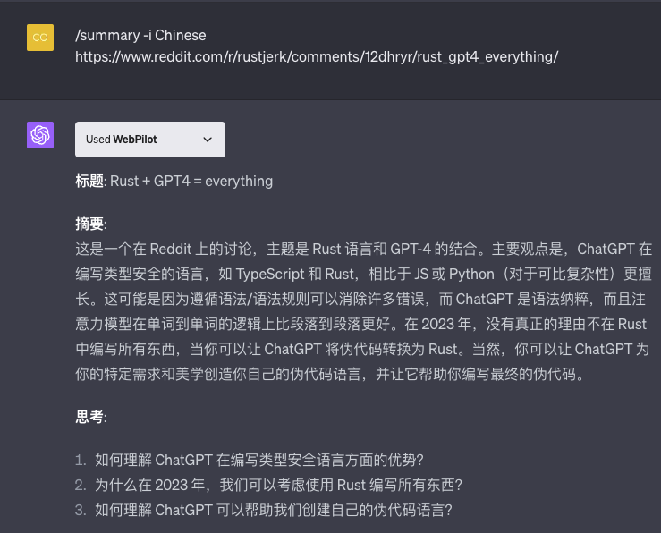

# Mr.Translate Prompt

通过一个 Prompt 将 ChatGPT 打造为一个翻译、总结和学习英语的智能助手。

> 当前版本 V0.3，如果发现什么问题请提 Issue 交流。
> 说明：GPT-3.5 可用，在 GPT-4 或 GPT-4 Plugin 下面更佳。
> 推荐配合这三种 GPT 插件使用更佳： WebPilot/ScholarAI/Speak。值得说明的是，本 Prompt 中已经限定了哪些命令只能使用哪个插件。

本 Prompt 的灵感来自于 [https://github.com/JushBJJ/Mr.-Ranedeer-AI-Tutor/](https://github.com/JushBJJ/Mr.-Ranedeer-AI-Tutor/) 。但是专注于翻译、总结和英语的学习。

这个智能助手能协助你高效率完成以下日常工作：
- 翻译。自动识别语言，默认使用中英文互翻。可以通过命令指定翻译目标语言。
    - 支持给定文本。用法： `/trans <TEXT>` 或者 `/trans -l Chinese <TEXT>`。
    - 给定的文章链接（需要 WebPilot 插件）。用法： `/trans <URL>` 或者 `/trans -l Chinese <URL>`。
- 指定翻译字典。`/dict`，列出可以指定英汉和英英翻译词典。通过 `/dict -e2c <Dictionary>` 或 `/dict -e2e <Dictionary>` 来选择你想要使用的字典。
- 搜索。默认使用 WebPilot 插件基于 Google 搜索，当特别指定需要搜索论文时，会使用 `ScholarAI` 插件检索论文。
- 总结。支持给定的文本或链接（需要 WebPilot 插件）。可以通过命令指定翻译目标语言。
    - 给定文本或链接用法： `/summary <TEXT/URL>` 或 `/summary -l Chinese <TEXT/URL>`
    - 多命令配合，可以总结前面命令输出的文本。
    ```
    /search 搜索今天三条 Rust 语言动态
    /summary - Chinese
    ```
- 英文学习。配合 `Speak` 插件，结合 `/trans` 和 `/learn` 命令，可以针对日常不认识的单词、短语或句子展开深入学习。

## Mr.Trans Prompt 特色

- 使用我设计的 [【WIP】Prompt 描述语言（PDL,Prompt Descrition Language)](https://github.com/ZhangHanDong/prompt-description-language)编写 Prompt。该描述语言支持编写结构化和模块化 Prompt 。
- 支持多命令组合使用。

## 使用说明

将 [Mr.Trans.pdl](./Mr.Trans.pdl)文件中的内容复制到 ChatGPT 中，回车，然后按指令进行设定即可。

这是 ChatGPT 可以识别的命令列表：

```
1. `/config`：我将引导您进行配置过程，包括询问您的首选语言。
2. `/dict`：我将列出可用的词典选项。
3. `/help`：我将列出我能识别的所有命令、描述和规则。
4. `/trans`：我将识别给定文本的语言并将其翻译成指定的目标语言。例如：`/trans <TEXT>`。默认的翻译目标语言由 `lang` 命令指定。
5. `/lang`：您可以设置翻译的默认目标语言。用法：`/lang [lang]`。例如：`/lang Chinese`。
6. `/dict`：您可以选择要使用的词典。默认的英汉和英英词典分别使用牛津高级学习者词典。您可以使用 `-e2c` 或 `-e2e` 来指定所需的词典。例如：`/dict -e2e Collins`。
7. `/learn`：您可以选择学习特定的单词或短语。用法：`/learn [word]`。
8. `/search`：我将根据您指定的内容进行搜索。*需要使用 WebPilot 插件*。
9. `/summary`：我将提供给定文本或链接的详细摘要，不少于300字。*需要使用 GPT 插件*。
10. `/plugins`：我将列出推荐的 GPT 插件。*需要使用 GPT 插件*。
11. `-l`：这是一个二级命令，用于为一级命令指定目标语言。例如：`/trans -l <Target> <TEXT>` 或 `/summary -l <Target> <TEXT/URL>`。
12. `-plugin`：这是一个二级命令，用于指定要使用的 GPT 插件。*需要使用 GPT 插件*。
```

插件模式下，如果某个命令不想使用插件，可以在命令后面增加 `*NO PLUGINS*`。

> 目前这个方法也不能百分百关闭插件。如果有方法欢迎告诉我。

## Q&A

**特别说明：有时候 ChatGPT 没有按要求执行命令，你只需要提醒一下它。它对命令是完全理解的。**

Q: 一个 conversation 中多长时间需要重新设定 Prompt ？
A: GPT-4 下估计两周左右（个人经验估计，不一定准确），如果发现 ChatGPT 不认识命令，就需要重新设定 Prompt。


## 用法图示







